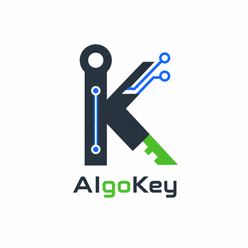

<p align="center">
  
</p>

<h1 align="center">AigoKey</h1>

<p align="center">
  稳定可靠的 AI Token 套餐 — Codex Agent · GPT + Image 系列模型<br>
  <strong>¥5/天起 · 每天 $30-$200 额度 · 不做 API 按次调用</strong>
</p>

<p align="center">
  <a href="https://wonder-o.github.io/aigokey_website/">🌐 在线预览</a> ·
  <a href="https://wonder-o.github.io/aigokey_website/codex-help">📖 帮助文档</a>
</p>

---

## ✨ 为什么选择 AigoKey

不用研究 API、不用计算 token、不用频繁充值、不用担心余额忽高忽低。

把 Codex Agent、GPT 系列模型和 Image 系列模型直接用到日常工作里——写方案、改代码、生成图片、做翻译，打开就能用。

## 💰 五档套餐

| 套餐 | 价格 | 每日额度 | 周期总额度 | 适合场景 |
|:---:|:---:|:---:|:---:|---|
| **日卡** | ¥5/天 | $30/天 | — | 当天急用、体验试用 |
| **周卡** | ¥48/周 | $50/天 | $350/周 | 一周项目冲刺 |
| **轻量版** | ¥168/月 | $50/天 | $1,500/月 | 日常办公、轻量使用 |
| **标准版** ⭐ | ¥300/月 | $100/天 | $3,000/月 | 长期高频、固定预算 |
| **专业版** | ¥588/月 | $200/天 | $6,000/月 | 重度创作、密集工作流 |

## 👥 适用人群

AigoKey 覆盖开发、产品、运营、设计、电商、自媒体、外贸、教育、销售、人力行政和数据分析等高频 AI 使用场景。

- **开发者** — 用 Codex Agent 读项目、改代码、跑验证
- **自媒体** — 用 GPT 做选题脚本、用 Image 模型生成封面
- **电商运营** — 商品标题、详情页、客服话术成套产出
- **外贸** — 开发信、客户邮件、报价翻译、产品说明图
- **产品设计** — PRD 梳理、竞品分析、原型 Demo
- **市场营销** — 受众拆解、投放脚本、海报素材
- **教育培训** — 课程大纲、讲义、练习、点评反馈
- **数据分析** — 指标口径、异常解释、分析结论

## 🛠️ 技术栈

- **Vue 3** + **TypeScript** — 前端框架
- **Vite** — 构建工具
- **Tailwind CSS 3** — 样式系统
- **vite-ssg** — 静态站点生成（SSG），每个页面预渲染为独立 HTML
- **@unhead/vue** — SEO meta 标签管理

## 🚀 本地开发

```bash
# 安装依赖
npm install

# 启动开发服务器
npm run dev

# 构建（生成 dist/ 静态文件）
npm run build

# 预览构建产物
npm run preview
```

## 📦 部署

构建后 `dist/` 目录包含完整的静态文件，可直接部署到：

- **GitHub Pages** — 推送到 `main` 自动部署
- **阿里云 OSS** — 通过 CI/CD 自动同步

## 📁 项目结构

```
src/
├── App.vue                  # 根组件
├── main.ts                  # 入口（vite-ssg）
├── style.css                # 全局样式 + Tailwind
├── composables/
│   ├── useHostUrl.ts        # iframe/父级域名适配
│   └── useI18n.ts           # 中英文切换
├── router/
│   └── index.ts             # 路由配置
└── views/
    ├── HomeView.vue         # 首页（SSG 直出 + SEO）
    ├── CodexHelpView.vue    # 帮助文档（SSG 直出 + SEO）
    ├── SubscriptionView.vue # 订阅说明
    └── FreeTrialView.vue    # 免费试用
```

## 📄 许可

© 2026 AigoKey. 保留所有权利。
